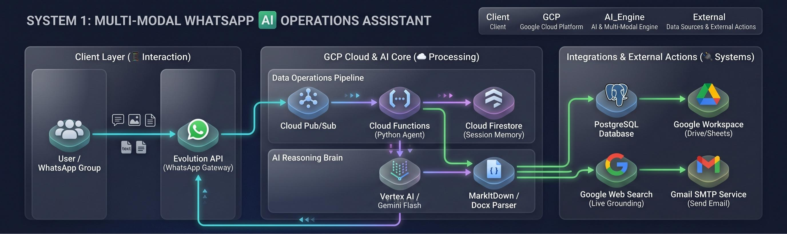
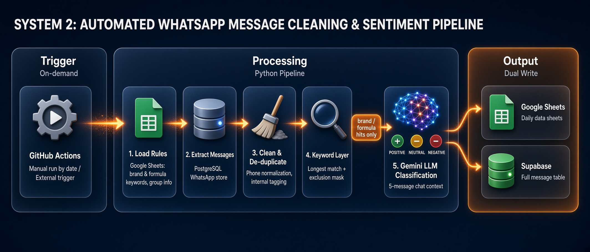
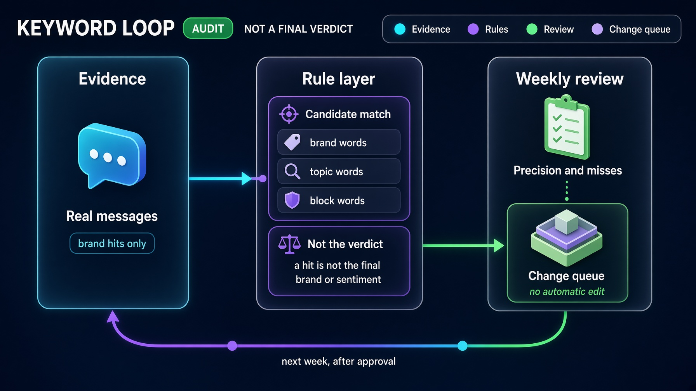

# 🚀 AI-Driven Business Operations & Marketing Intelligence Suite

> **An enterprise AI operations portfolio** integrating real-time Generative AI assistants with automated data pipelines. Built to eliminate manual daily workflows, unlock conversational data insights, and turn community chat into structured brand-sentiment data.

**English** | [繁體中文](README_zh.md)

---

## 📌 Executive Summary

This repository demonstrates the end-to-end implementation of **Generative AI (Gemini 3.8 Flash in System 1; `gemini-3.1-flash-lite` in System 2)** and **Google Cloud Platform (GCP)** architecture in real-world business operations. The solution consists of two complementary systems:

1. **🤖 Multi-Modal WhatsApp AI Operations Assistant (Real-Time)**: An on-demand conversational agent deployed on GCP. Non-technical staff can query databases via natural language, extract data from documents/images, and dispatch CSV/email reports directly within WhatsApp.
2. **📊 WhatsApp Community Sentiment & NLP Pipeline (Automated Batch)**: A GitHub Actions data pipeline, triggered manually, that pulls a time window of WhatsApp group messages (the last 65 minutes by default), de-duplicates and keyword-filters them, runs context-aware LLM brand-sentiment classification, and dual-writes a 48-column dataset to Google Sheets and Supabase for dashboards and negative-sentiment alerts.

---

## 🤖 System 1: Multi-Modal WhatsApp AI Operations Assistant
> The System 1 source code is not included in this repository; the system is shown through the demo video and the architecture diagram below.
>
> **Ownership:** The WhatsApp message intake channel was provided by the company; the rest of the application code was written by me.

### 🏗️ Cloud & Agent Architecture

### 🎬 Demo Video (2:13)

https://github.com/user-attachments/assets/b4423a86-953f-437b-a650-f37288afe17b

Recorded on the live system. Sensitive company data (chat list, contacts, emails, database schema, customer data, internal brand names) is redacted.

| Time | Scenario |
|---|---|
| 0:00 | Test 1: Multi-turn memory & `/reset` |
| 0:20 | Test 2: Natural-language database query (Text-to-SQL) |
| 0:51 | Test 4: Image OCR & document understanding |
| 1:07 | Test 3 & 5: Data analysis, CSV delivery & email report |
| 1:53 | Test 6: Real-time web search |

*Test 7 (group @mention filtering & idempotency) is a production guardrail and is not shown in the video.*

### 🧪 Verified Capabilities & Test Scenarios

The system has undergone end-to-end verification across operational workflows:

* **Test 1: Multi-Turn Memory & Session Reset (`/reset`)**
  * **Workflow:** Verified contextual memory across conversations stored in Cloud Firestore.
  * **Result:** Agent recalls contextual user attributes (e.g., user identity) and cleanly wipes history upon issuing `/reset`.
* **Test 2: Natural Language Database Querying (Text-to-SQL)**
  * **Workflow:** Inspects database schemas dynamically and executes safe read-only `SELECT` queries with connection pooling (SQLAlchemy).
  * **Result:** Automatically queries message counts and timestamps, displaying real-time UI feedback (`🔍 Executing SQL...`) before outputting structured insights.
* **Test 3: Big Data Analysis & Physical File Delivery**
  * **Workflow:** Extracts datasets into temporary storage, performs LLM sentiment/categorization analysis, and compiles downloadable reports.
  * **Result:** Delivers real-time progress indicators (`🧠 Analyzing data... ➔ 📊 Packaging report...`) and pushes the physical `.csv` file directly into the WhatsApp chat window.
* **Test 4: Multi-Modal & Document Understanding (Images & Files)**
  * **Workflow:** Evaluates image OCR and multi-format document parsing (`.docx`, `.xlsx`, `.pdf`, `.pptx`).
  * **Result:** Successfully extracts text and embedded flowcharts/screenshots inside documents, combining visual and textual reasoning into concise summaries.
* **Test 5: Automated Email Reporting with Attachments**
  * **Workflow:** Connects with Gmail SMTP to compile formatted HTML reports with data attachments.
  * **Result:** Pushes formatted executive summaries with generated `.csv` files directly to designated stakeholder inboxes.
* **Test 6: Real-Time Web Grounding Search**
  * **Workflow:** Dispatches queries requiring external real-time data (e.g., today's international tech news, live exchange rates) using a dedicated Google Grounding client.
  * **Result:** Accurately summarizes live web data without conflicting with internal tool schemas.
* **Test 7: Group Mention Filtering & Idempotency (Production Guardrail)**
  * **Workflow:** Filters non-relevant group messages and avoids duplicate executions from Pub/Sub retries.
  * **Result:** Agent remains silent unless explicitly `@mentioned` in groups; Firestore-backed deduplication ignores duplicate message IDs.

---

## 📊 System 2: WhatsApp Community Sentiment & NLP Pipeline

Incremental batch job that converts raw parenting-community WhatsApp chats into brand-level sentiment data (35 standard brand / sub-brand columns across 9 brand families + "other brands"), ready for BI dashboards and CS/PR alerting.

> **Ownership:** The data collection layer and the PostgreSQL message database were provided by the company; the rest of the application code in this repository was written by me.

> **🌐 Built to be reusable across industries.** Infant formula is the real-world deployment, but the engine itself is industry-agnostic:
> * **Rules live in a sheet, not in code:** brands, sub-brands, keywords, context words and exclusions are all maintained in Google Sheets. Monitoring a different industry (beauty, consumer electronics, F&B, insurance…) mainly means swapping the keyword sheet and updating one column mapping (`PRODUCT_SHORT_BRANDS` / `CODE_TO_COLUMN_MAP`).
> * **Any chat-style source:** WhatsApp is the current input, but the same pipeline fits Telegram groups, social-media comments or customer-service transcripts.
> * **A reusable method:** rule-based pre-filtering to control LLM cost → context-aware LLM sentiment → brand-hierarchy roll-up → negative-sentiment alerts.

### 🏗️ Pipeline Flow

#### 🔁 Self-improving keyword loop
The keyword rules are not tuned by hand. A separate **Keyword Agent** reviews the pipeline's results, finds missed and false matches, and updates the rules. The next run picks up the new rules automatically, so accuracy improves with every cycle.

### 🌟 What the Pipeline Does

* **⚙️ Business-editable rules:** Brand keywords (`CONTAINS` / `COMBO` / `REGEX` match types, each mapped to a `Brand` + `Sub_Brand` code), topic keywords and exclusion words live in Google Sheets, so the marketing team can tune detection without touching code. A startup health check warns when a core brand term is missing from the keyword sheet. See [Keyword Sheet Structure](#-keyword-sheet-structure).
* **🧹 Smart de-duplication:** Merges the same message seen twice within 60 seconds in the same group (e.g. WhatsApp virtual ID vs. real number), keeps the highest-quality phone format, and tags internal/staff accounts from a private list.
* **💰 Cost-controlled AI:** A longest-match keyword layer (with exclusion masking and word-boundary checks for pure-English keywords, so e.g. `OPO` no longer matches inside `popo`) decides which messages need the LLM; only messages that mention a tracked brand are sent, processed with 10 parallel workers.
* **🧠 Context-aware sentiment:** Each candidate message is sent with its quoted message and up to 5 previous messages from the same group. The LLM returns structured JSON: spam flag, per-brand sentiment (`P` positive · `I` neutral/inquiry · `N` negative) and the original message it replies to.
* **🛡️ Anti-hallucination guardrails:** Prompt rules and few-shot examples stop the model from guessing brands from generic ingredients (e.g. DHA, hydrolysed), from misreading education terms like "A+", or from linking pronouns to brands that never appear in context. Spam (resale, points-sharing, promo forwards) is filtered out.
* **🧩 Contextual short-name resolution:** Short product names that are ambiguous on their own (e.g. a sub-brand name without its parent brand, `COMBO` rules) are only counted when the context confirms them: the quoted message mentions the parent brand, the parent brand appeared in the same group within the last 30 minutes, or the directly preceding message clearly talks about infant formula.
* **🔗 Reply tracing:** When a message answers an earlier one, Python re-aligns the model's `reply_origin` to the full original text (emoji included) in the context window, producing a clean `reply` column.
* **🏷️ Brand roll-up & alert flag:** Sub-brand sentiments automatically roll up to their parent brand column (`MASTER_BRAND_ROLLUP`, N > P > I priority), a literal-match safety net marks a brand as `I` if the LLM missed a brand that was explicitly named, and a `warning` flag marks negative mentions of the core brand for CS/PR follow-up.
* **🚦 Circuit breaker:** An AI health check runs before the batch, and the job aborts after 5 consecutive LLM failures (e.g. exhausted API credit) so no half-processed data is written. If the LLM returns a sentiment value other than `P`/`N`/`I`, a dedicated correction prompt re-asks once; if that also fails the job stops before any write, and queued AI tasks are cancelled.
* **💾 Dual-write output:** A fixed 48-column schema (12 message fields + 35 brand columns + `Other_Brands`) is appended to half-month Google Sheets (`yymm_DailyData_Part1` = days 1–15, `Part2` = 16–end) with formula-injection escaping and 429 back-off retries, and bulk-inserted into a Supabase `message_full` table together with message metadata (message ID, instance ID, raw timestamp, message type, media caption, sender LID). The insert uses `ON CONFLICT (message_id) DO NOTHING`, and the run summary reports how many rows were newly inserted vs. skipped as duplicates. Each target can be switched off per run with the `write_sheet` / `write_database` inputs. Dates are normalised to `YYYY-MM-DD` with day-first parsing, so `02/10/2026` is never read as 10 February. A test-sheet mode redirects all output away from production sheets.
* **🔁 Incremental runs & reruns:** The workflow is triggered manually (`workflow_dispatch`). A run without a date processes the last 65 minutes (HKT); the incremental window is 5 minutes longer than the run interval to guard against gaps. A concurrency lock queues overlapping runs so two jobs never write at once. Reruns via the workflow's `target_date` input: a full day (`260928` or `2026-09-28`), a multi-day range (`2026-07-01 to 2026-09-30`, `260701-260930`) or a precise time range (`260928 14:00-16:00`, or a date plus the separate `time_start` / `time_end` inputs, e.g. `9:00` → `09:00:00`).
* **📱 WhatsApp LID handling:** Device-linked IDs (`@lid` suffix or 13–16-digit numbers that are not valid phone numbers) are recognised, stored as `senderLid`, and never written as a real `userPhone`. Image/video captions are analysed when present.
* **📊 Run summary:** The final log summary includes the number of sentiment corrections and the per-brand hit distribution for the batch.
* **🎯 Group filter:** An optional `target_group_ids` input (comma-separated) limits a run to specific WhatsApp groups, e.g. to rerun just one group's history.

### 🧰 Supporting Scripts

* `dashboard.py` – aggregates a day's DailyData into the monthly Google Sheets dashboard (reach, group categories, brand sentiment counts). Run separately with `--dashboard_id`.
* `scripts/email_automation/` + `docs/MANUS_EMAIL_AUTOMATION.md` – daily summary email with negative-sentiment alerts, orchestrated by a Manus AI schedule.

### 🚀 Setup

1. `pip install -r requirements.txt` (Python 3.11)
2. Copy `.env.example` → `.env` and fill in values (for local runs), and place the Google service-account key at `service_account.json` (or pass the full JSON in `GOOGLE_SERVICE_ACCOUNT_KEY`). Share the keyword, group-info and DailyData sheets with the service account.
3. Optional: copy `internal_phones.example.json` → `internal_phones.json` (gitignored) to tag internal accounts.
4. `python main.py` (empty `MANUAL_DATE` = last 65 minutes; `MANUAL_DATE=260928` = full day; `MANUAL_DATE="2026-07-01 to 2026-09-30"` = date range; `MANUAL_DATE="260928 14:00-16:00"` = time range, or `MANUAL_TIME_START` / `MANUAL_TIME_END`; `WRITE_SHEET=false` / `WRITE_DATABASE=false` skip a target). Optional `TARGET_GROUP_IDS="<id1>,<id2>"` processes only those groups.

**GitHub Actions secrets** (workflow: `.github/workflows/daily_whatsapp_nlp.yml`):

| Secret | Required | Purpose |
| :--- | :--- | :--- |
| `GCP_SA_KEY` | ✅ | Google service-account JSON |
| `POE_API_KEY` | ✅ | Poe API key (LLM) |
| `DB_HOST`, `DB_NAME`, `DB_USER`, `DB_PASSWORD` | ✅ | Source PostgreSQL (WhatsApp message store) |
| `DB_PORT` | optional | Defaults to `5432` |
| `SOURCE_VIEW` | optional | Source view / table to read messages from (`schema.name` or `name`, letters/digits/underscore only; validated and quoted as an SQL identifier). Defaults to `public.messages_view` |
| `KEYWORDS_SPREADSHEET_ID` or `KEYWORDS_SHEET_URL` | ✅ (one of) | Sheet with `brand_keywords` / `ift_keywords` tabs (tab names overridable via `BRAND_SHEET_NAME` / `IFT_SHEET_NAME`) |
| `GROUPINFO_SHEET_URL` | ✅ | Sheet with `groups` tab (group ID → name) |
| `SUPABASE_DB_HOST`, `SUPABASE_DB_USER`, `SUPABASE_DB_PASSWORD` | for Supabase | Supabase session pooler; write is skipped if host/password is empty |
| `SUPABASE_DB_PORT`, `SUPABASE_DB_NAME` | optional | Default `5432` / `postgres` |
| `TEST_TARGET_SHEET_URL` | optional | If set, all output goes to this test sheet |
| `INTERNAL_PHONES_JSON` | optional | JSON like `{"LabelA": ["9xxxxxxx"], "LabelB": [...]}` for the `Internal` column |

Trigger: the workflow is triggered manually via **Actions → WhatsApp Data NLP Pipeline → Run workflow** (optional `target_date`, `time_start`, `time_end`, `target_group_ids`, and the `write_sheet` / `write_database` checkboxes).

### 🔑 Keyword Sheet Structure

The full production keyword lists stay in a private Google Sheet; [`examples/`](examples/) shows only a curated excerpt with the real design notes.

**`brand_keywords` tab** – one row per detection rule:

| Column | Meaning |
| :--- | :--- |
| `Keyword` | Text or regex to match |
| `Match_Type` | `CONTAINS` (plain match), `COMBO` (ambiguous short name, only counted with context, see above), `REGEX` |
| `Combo_With` | For `COMBO`: the parent-brand word that must appear in context |
| `Brand` / `Sub_Brand` | Brand code pair (e.g. `friso` / `prestige`), mapped to one of the 35 output columns by `CODE_TO_COLUMN_MAP` in `main.py`; `master` = the parent brand itself |

**`ift_keywords` tab** – `type` + `keyword`: `formula_feature` (infant-formula context words that support short-name resolution), `general` (topic keywords), `exclude` (phrases masked before matching to avoid false hits).

**Design principles behind the keyword set:**

1. **Anchor terms (`CONTAINS`)** – Chinese and English brand names plus common typos and homophones that parents actually type (e.g. `新美力` for 心美力).
2. **Typo anchors (`REGEX`)** – one pattern catches a family of misspellings without over-matching (e.g. `牛(?:[藍蘭]牌?|腩牌)` catches 牛藍／牛蘭／牛腩牌 but not 牛腩湯).
3. **Context binding (`COMBO`)** – short or ambiguous words only count next to their parent brand or a formula context word: `prestige` / `signature` are credit-card words, `雀巢` also sells coffee, `neo` / `php` are everyday English or tech terms, `a仔` is local mum slang.
4. **Connector-word penetration (`REGEX`)** – product names are matched even with Cantonese filler in between (`美素嘅皇家`, `愛他美個白金`), in both word orders, with negative lookahead for financial phrases (白金卡).
5. **Exclusion masks (`exclude`)** – longer everyday phrases are masked before matching so shorter keywords can't fire inside them: `有機會` vs 有機, `visa signature`, `考到A+`, `大人奶粉`.
6. **Tiered topic words** – `formula_feature` words are strong triggers that confirm an infant-formula context; many `general` words are deliberately downgraded to tag-only so they don't pull unrelated messages (eczema creams, probiotic drops, strollers) into the LLM.

---

## 💼 Business Impact & Efficiency Gains

| Metric / Dimension | Traditional Manual Workflow | AI-Automated Solution | Impact & Value Added |
| :--- | :--- | :--- | :--- |
| **Daily Data Processing** | 2 – 3 Hours / day | ~15 Minutes / day | **>80% Operational Time Saved** |
| **Data Querying Barrier** | Relies on data/IT team requests | Instant via WhatsApp conversation | **Zero learning curve** for non-technical teams |
| **Crisis Detection** | Discovered passively after complaints | Automated daily morning email alerts | Enables **proactive PR & CS intervention** |

---

## 🛠️ Technology Stack

**System 1 – WhatsApp AI Operations Assistant**
* **AI & Multi-Modal:** Google Vertex AI (Gemini 3.8 Flash), MarkItDown, Python-docx, Prompt Engineering
* **Cloud & Serverless:** Google Cloud Platform (Cloud Functions, Cloud Run, Cloud Pub/Sub, Cloud Secret Manager, Cloud Firestore)
* **Data:** PostgreSQL (read-only Text-to-SQL), SQLAlchemy (Connection Pooling)
* **Gateways & Integrations:** Evolution API (WhatsApp Gateway), Google Workspace APIs (Drive & Sheets), Gmail SMTP

**System 2 – Community Sentiment & NLP Pipeline (code in this repository)**
* **AI:** Poe API (OpenAI-compatible) with `gemini-3.1-flash-lite`, Prompt Engineering
* **Data & Storage:** PostgreSQL (source, psycopg2), Supabase (target), Pandas
* **Automation & Integrations:** GitHub Actions, Google Workspace APIs (Sheets & Drive)

---

## 🔒 Security & Privacy Notice

* **Encrypted Secrets:** All credentials, database hosts, sheet URLs and API tokens are supplied via environment variables (GCP Secret Manager / GitHub Secrets); the code ships with no real defaults (see `.env.example`).
* **Private Lists Stay Private:** Internal account phone lists are loaded at runtime from a secret or a gitignored local file, never committed.
* **De-Identified Data:** All demonstration logs, database schemas, and media samples are sanitized for public presentation.
