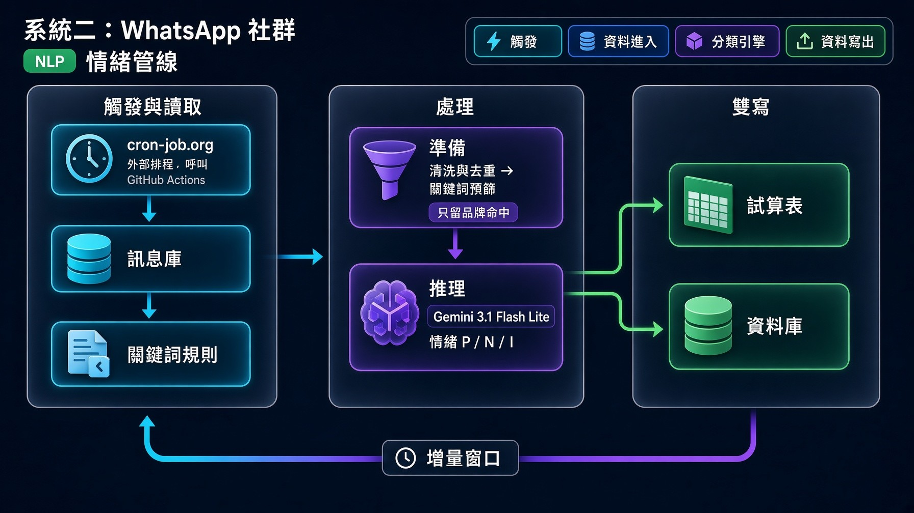

# 🚀 AI 數智營運與市場情報自動化系統 (AI-Driven Operations Suite)

> **雙軌企業級 AI 營運賦能專案**：結合即時生成式 AI 助理與自動化數據管線，旨在消除重複性人工日常作業、實現對話式數據提取，並將社群對話轉化為結構化的品牌輿情數據。

[English](README.md) | **繁體中文**

---

## 📌 專案總覽 (Executive Summary)

本專案展示了如何將 **生成式 AI（Gemini 3.8 Flash）** 與 **Google Cloud Platform (GCP) 雲端架構** 實際落地於日常商業營運。全套解決方案包含兩大互補的核心系統：

1. **🤖 WhatsApp 多模態 AI 營運小幫手（即時互動）**：部署於 GCP 雲端的智慧營運助理。團隊非技術同仁只需透過日常 WhatsApp 對話，即可直接以自然語言查詢資料庫、解析多格式文件與圖片，並一鍵產出實體報表或寄送 Email。
2. **📊 WhatsApp 社群輿情與 NLP 數據管線（定時批次處理）**：以 GitHub Actions 驅動的數據管線，每日抽取前一日 WhatsApp 群組訊息，完成去重與關鍵詞篩選後，交由具上下文理解的 LLM 進行品牌情緒分類，並將 31 欄標準化數據雙軌寫入 Google Sheets 與 Supabase，供儀表板及負面輿情警報使用。

---

## 🤖 系統一：WhatsApp 多模態 AI 營運小幫手
### 🏗️ 雲端與智能體架構圖 (Architecture)

### 🎬 實機示範影片 (2:13)

Uploading whatsapp_ai_demo_2026-09-30_final.mp4…

於實際運行系統錄製，公司敏感資料（對話列表、聯絡人、電郵、資料庫結構、客戶數據、內部品牌名稱）均已打碼。

| 時間 | 測試場景 |
|---|---|
| 0:00 | 測試 1：多輪記憶與 `/reset` 重置 |
| 0:20 | 測試 2：自然語言查詢資料庫（Text-to-SQL） |
| 0:51 | 測試 4：圖片 OCR 與文件解析 |
| 1:07 | 測試 3 & 5：數據分析、CSV 發送與電郵報告 |
| 1:53 | 測試 6：聯網即時搜尋 |

*測試 7（群組 @Mention 喚醒與防重複消費）屬生產環境安全機制，影片中未示範。*

### 🧪 核心功能與實戰測試場景 (Verified Test Scenarios)

本系統已通過完整的功能驗證測試，涵蓋各項日常營運應用：

* **測試 1：多輪記憶與會話重置（Session & Reset）**
  * **測試內容：** 驗證 Cloud Firestore 的會話持久化記憶與重置指令。
  * **實測結果：** Agent 能在多輪對話中精準記憶用戶屬性（如姓名與歷史背景），收到 `/reset` 後即時清空上下文記憶。
* **測試 2：資料庫唯讀查詢與結構解析（Text-to-SQL）**
  * **測試內容：** 驗證連線池（Connection Pool）、Schema 解析與 SQL 執行。
  * **實測結果：** 自動調用 `get_database_schema` 解析大小寫駝峰欄位，發送查詢進度提示（`🔍 正在為您執行 SQL...`）後精準輸出查詢結果。
* **測試 3：巨量數據分析與實體報表發送（Big Data & Send File）**
  * **測試內容：** 驗證數據暫存 CSV、LLM 深度營運分析及 WhatsApp 傳送實體檔案。
  * **實測結果：** 系統依序呈現進度通知（`🧠 正在進行深度智能分析... ➔ 📊 正在打包並發送檔案...`），並直接在 WhatsApp 視窗回傳 `.csv` 實體檔案與文字總結。
* **測試 4：多模態與各式文件解析（Multimodal & Documents）**
  * **測試內容：** 驗證圖片 OCR、Word（含內嵌截圖）、PDF、Excel 解析能力。
  * **實測結果：** 成功解析圖片與檔案內容，自動提取 Word 內嵌之流程圖/截圖交由視覺模型總結關鍵 SOP。
* **測試 5：電子郵件自動發送與附件寄送（Email Tool）**
  * **測試內容：** 驗證 Gmail SMTP 寄信與帶附件能力。
  * **實測結果：** 發送進度提示（`✉️ 正在整理報告內容並寄出...`），並將排版完整的 HTML 報告與實體 `data_report.csv` 附件寄送至指定信箱。
* **測試 6：聯網搜尋與即時資訊（Google Web Search）**
  * **測試內容：** 驗證獨立 Grounding 搜尋客戶端是否避開工具衝突。
  * **實測結果：** 成功檢索今日國際科技新聞、即時匯率等外部資訊，並回傳結構化摘要。
* **測試 7：群組 @Mention 喚醒與防重複消費（Idempotency & Group Filter）**
  * **測試內容：** 驗證群組防打擾與 Pub/Sub 重複推送防護（生產環境安全機制）。
  * **實測結果：** 群組中未 `@機器人` 時保持靜默；Firestore 冪等機制自動攔截重複的 Message ID，防止重複觸發。

---

## 📊 系統二：WhatsApp 社群輿情與 NLP 數據管線

每日批次任務，將母嬰社群 WhatsApp 原始對話轉化為品牌層級的情緒數據（追蹤 18 個奶粉品牌／子品牌 + 其他品牌），直接供 BI 儀表板與客服／公關警報使用。

### 🏗️ 數據管線流程 (Pipeline Flow)

### 🌟 核心功能亮點

* **⚙️ 業務團隊可自行維護規則：** 品牌關鍵詞（`CONTAINS` / `COMBO` / `REGEX` 三種匹配方式）、話題關鍵詞與排除詞均存放於 Google Sheets，行銷同事無需改程式即可調整識別邏輯。
* **🧹 智能去重：** 同一群組內 60 秒內內容相同的訊息自動合併（如 WhatsApp 虛擬 ID 與真實號碼重複入庫），保留品質最佳的號碼格式，並依私有名單標記內部／員工帳號。
* **💰 AI 成本控制：** 以最長匹配關鍵詞層（含排除詞遮罩）預先篩選，只有提及追蹤品牌的訊息才送入 LLM，並以 10 條執行緒並行處理。
* **🧠 上下文情緒判斷：** 每則候選訊息連同引用訊息及同群組前 5 則發言一併分析，LLM 以結構化 JSON 回傳：是否 Spam、各品牌立場（`P` 正面 · `I` 中立／詢問 · `N` 負面）及所回覆的前文原句。
* **🛡️ 防 AI 腦補機制：** 透過提示詞規則與 Few-shot 範例，禁止模型憑通用成分（如 DHA、水解）猜測品牌、誤判教育用語「A+」，或將代名詞關聯到前文從未出現的品牌；轉讓、代儲分、促銷轉發等訊息自動判為 Spam。
* **🔗 回覆溯源 (reply)：** 當訊息是回應前文時，Python 會把模型輸出的 `reply_origin` 與上下文逐句比對，還原完整原句（保留 Emoji），寫入 `reply` 欄位。
* **🏷️ 品牌歸併與警示：** 子品牌情緒依 N > P > I 優先順序歸併至主品牌，核心品牌出現負面評價時於 `warning` 欄標記，方便客服／公關跟進。
* **🚦 熔斷保護：** 批次開始前先檢測 AI 服務狀態，運行中連續 5 次 LLM 失敗（如 API 額度耗盡）即中止任務，避免寫入半成品數據。
* **💾 雙軌寫入：** 固定 31 欄格式，按半月分表寫入 Google Sheets（`yymm_DailyData_Part1` = 1–15 日，`Part2` = 16 日至月底），內建公式注入防護與 429 限流指數退避重試；同時批次寫入 Supabase `message_full` 表。另設測試表模式，避免污染正式數據。
* **🔁 一鍵重跑：** 預設處理香港時間昨日數據；於 Workflow 表單輸入 `target_date`（`yymmdd`）即可重跑指定日期。

### 🧰 配套腳本

* `dashboard.py`：將單日 DailyData 匯總至每月 Google Sheets 儀表板（觸及量、群組分類、品牌情緒統計），需另行以 `--dashboard_id` 執行。
* `scripts/email_automation/` 與 `docs/MANUS_EMAIL_AUTOMATION.md`：由 Manus AI 排程執行的每日摘要郵件與負面輿情警報。

### 🚀 安裝與設定 (Setup)

1. `pip install -r requirements.txt`（Python 3.11）
2. 本地執行時，複製 `.env.example` 為 `.env` 並填入數值，將 Google 服務帳戶金鑰存為 `service_account.json`，並把關鍵詞表、群組資訊表及 DailyData 表共用給該服務帳戶。
3. 選用：複製 `internal_phones.example.json` 為 `internal_phones.json`（已 gitignore）以標記內部帳號。
4. 執行 `python main.py`（設定 `MANUAL_DATE=yymmdd` 可處理指定日期）。

**GitHub Actions Secrets**（Workflow：`.github/workflows/daily_whatsapp_nlp.yml`）：

| Secret | 必填 | 用途 |
| :--- | :--- | :--- |
| `GCP_SA_KEY` | ✅ | Google 服務帳戶 JSON |
| `POE_API_KEY` | ✅ | Poe API 金鑰（LLM） |
| `DB_HOST`、`DB_NAME`、`DB_USER`、`DB_PASSWORD` | ✅ | 來源 PostgreSQL（WhatsApp 訊息庫） |
| `DB_PORT` | 選填 | 預設 `5432` |
| `KEYWORDS_SHEET_URL` | ✅ | 含 `brand_keywords` / `ift_keywords` 分頁的試算表 |
| `GROUPINFO_SHEET_URL` | ✅ | 含 `groups` 分頁的試算表（群組 ID → 名稱） |
| `SUPABASE_DB_HOST`、`SUPABASE_DB_USER`、`SUPABASE_DB_PASSWORD` | 寫入 Supabase 時 | Supabase Session Pooler；host 或密碼為空時自動略過 |
| `SUPABASE_DB_PORT`、`SUPABASE_DB_NAME` | 選填 | 預設 `5432` / `postgres` |
| `TEST_TARGET_SHEET_URL` | 選填 | 設定後所有輸出只寫入此測試表 |
| `INTERNAL_PHONES_JSON` | 選填 | 格式如 `{"LabelA": ["9xxxxxxx"], "LabelB": [...]}`，用於 `Internal` 欄位 |

觸發方式：**Actions → Daily WhatsApp Data NLP Pipeline → Run workflow**（可選填 `target_date`），或由外部排程發送 `trigger-nlp-pipeline` 類型的 `repository_dispatch` 事件。

---

## 💼 商業價值與量化成效 (Business Impact)

| 營運指標 / 環節 | 傳統人工處理模式 | 導入 AI 數智系統後 | 創造的商業價值 |
| :--- | :--- | :--- | :--- |
| **每日數據整理耗時** | 每日需花費 2 ～ 3 小時 | 縮短至約 15 分鐘 | **節省超過 80% 人工作業時間** |
| **業務數據獲取門檻** | 需向技術人員提需求等待匯出 | 隨時在 WhatsApp 提問即得 | **跨團隊溝通成本歸零**，決策更即時 |
| **公關客訴反應速度** | 被動發現或於數日後人工覆盤 | 每日主動掃描並寄出危機警報 | 搶先於第一時間**主動介入處理客訴** |

---

## 🛠️ 技術與工具應用 (Tech Stack)

* **AI 與多模態模型：** Google Vertex AI (Gemini Flash)、Poe API（OpenAI 相容介面，`gemini-3.1-flash-lite`）、MarkItDown、Python-docx 文件多模態解析、提示詞工程 (Prompt Engineering)
* **雲端與無伺服器架構：** Google Cloud Platform (Cloud Functions、Cloud Run、Cloud Pub/Sub 事件驅動、Secret Manager 密鑰管理、Cloud Firestore 狀態儲存)
* **資料庫與數據處理：** PostgreSQL、Supabase、psycopg2、SQLAlchemy（連線池管理）、Pandas、正則表達式
* **自動化流程與 API 串接：** Evolution API (WhatsApp 通道)、Google Workspace APIs (Sheets & Drive)、Gmail SMTP 郵件引擎、GitHub Actions 定時排程

---

## 🔒 數據隱私與安全性聲明 (Security & Privacy)

* **資安防護：** 所有資料庫主機、試算表網址、API Key 與服務憑證均透過環境變數提供（Secret Manager / GitHub Secrets），程式碼不含任何真實預設值（見 `.env.example`）。
* **私有名單不入庫：** 內部帳號號碼清單於執行時由 Secret 或已 gitignore 的本地檔案載入，絕不提交至儲存庫。
* **去識別化展示：** 本專案展示之對話紀錄、資料庫欄位及演示數據均已進行嚴格的脫敏（De-identification）與模擬數據替換，無任何真實客戶隱私資料外洩。
